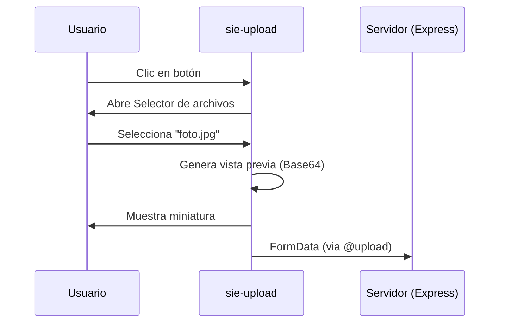

# Documentación: Componente `sie-upload`

El componente `sie-upload` es un wrapper personalizado sobre Quasar diseñado para estandarizar la selección y pre-visualización de archivos en el ecosistema **Sieweb**.

## 1. Uso Básico

Para integrar el componente en una página o componente Vue/Quasar:

```vue
<template>
  <sie-upload 
    title="Subir documento"
    @upload="onUpload"
  />
</template>

<script>
import SieUpload from 'components/SieUpload.vue'

export default {
  components: { SieUpload },
  methods: {
    onUpload(files) {
      console.log('Archivos seleccionados:', files)
    }
  }
}
</script>
```

---

## 2. Propiedades (Props)

| Propiedad | Tipo | Defecto | Descripción |
| :--- | :--- | :--- | :--- |
| `title` | String | `'Subir archivo'` | Texto que se muestra en el botón/área de subida. |
| `allow` | Array | `[]` | Extensiones permitidas (ej: `['jpg', 'pdf']`). |
| `multiple` | Boolean | `false` | Permite seleccionar más de un archivo. |
| `preview` | Boolean | `true` | Muestra una miniatura automática si el archivo es una imagen. |
| `src` | String | `null` | URL de una imagen existente (ej: edición). |
| `multimedia`| Boolean | `false` | Si es `true`, cambia el diseño a un estilo de "Galería". |
| `disabled` | Boolean | `false` | Deshabilita la interacción con el componente. |
| `icon` | String | `'wallpaper'` | Icono de Quasar a mostrar. |

---

## 3. Eventos (Emits)

* **`@upload(files)`**: Se dispara cuando se seleccionan archivos. Retorna un `Array` de objetos `File`.
* **`@delete(file)`**: Se dispara al hacer clic en el botón de eliminar. Retorna la información del archivo eliminado.
* **`@uvideo`**: Evento específico para acciones relacionadas con video.

---

## 4. Funcionamiento Interno

1. **Gestión de Archivos**: Utiliza una clase auxiliar `Upload` para abstraer la lógica del input oculto.
2. **Pre-visualización**: Emplea el método `createImage` para generar un Base64 local del archivo antes de subirlo al servidor.
3. **Limpieza**: Implementa `beforeUnmount` para eliminar listeners y referencias al DOM.

---

## 5. Ejemplo de Flujo de Datos


