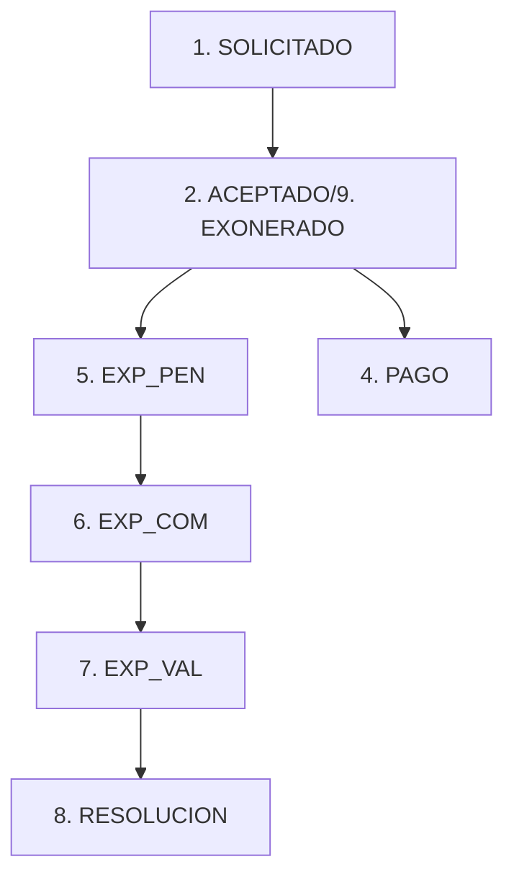

# Reglas de Negocio del Modelo BECA_SOLICITUD

## Tabla de Contenidos
- [Estados del Proceso](#estados-del-proceso)
- [Requisitos para Crear Solicitud](#requisitos-para-crear-solicitud)
- [Aprobación de Solicitud](#aprobación-de-solicitud)
- [Eliminación de Solicitud](#eliminación-de-solicitud)
- [Actualización Automática de Estados](#actualización-automática-de-estados)
- [Sincronización de Deudas](#sincronización-de-deudas)
- [Sincronización de Documentos](#sincronización-de-documentos)
- [Agregar Estudiante Posterior](#agregar-estudiante-posterior)
- [Resumen de Validaciones](#resumen-de-validaciones)
- [Flujo de Estados](#flujo-de-estados)

---

## Estados del Proceso

```javascript
ESTADO_SOLICITADO = 1          // Solicitud inicial
ESTADO_ACEPTADO = 2            // Aprobada, genera deuda
ESTADO_RECHAZADO = 3           // Rechazada
ESTADO_PAGO = 4                // Con pagos registrados
ESTADO_EXP_PEN = 5             // Expediente pendiente
ESTADO_EXP_COM = 6             // Expediente completo
ESTADO_EXP_VAL = 7             // Expediente validado
ESTADO_RESOLUCION = 8          // En resolución
ESTADO_EXONERADO = 9           // Exonerado (sin deuda)
ESTADO_ESTUDIANTE_AGREGADO = 10 // Hijo agregado posteriormente
```

---

## Requisitos para Crear Solicitud

### Método: `procesoSolicitud`

### A. Requisitos por Colegio

#### Colegio '0057'
- **Antigüedad:** Mínimo 4 años (año actual - año ingreso > 3)
- **Cantidad de hijos:** Más de 1 hijo activo matriculado
- **Historial de becas:** NO haber tenido beca por 18+ meses (≈2 años)

#### Colegio '0010'
- **Permanencia:** Mínimo 2 años
- **Cantidad de hijos:** Máximo 2 hijos (no puede tener 3 o más)

### B. Requisitos Generales

1. **No tener solicitud previa** en el periodo activo
2. **No tener deudas pendientes** de pensión (solo para colegios configurados)
3. **Debe existir un periodo activo** de becas

### C. Validaciones de Hijos

Solo cuenta alumnos:
- Con `MATRICULA = 'S'`
- Con estados **activos** (excluye: F, R, E, T, D)
  - F: Finalizado
  - R: Retirado
  - E: Egresado
  - T: Trasladado
  - D: Desactivado

### D. Proceso de Creación

1. Valida todos los requisitos anteriores
2. Genera ID de solicitud usando secuencia `GEN_BECA_SOLICITUD_ID`
3. Inserta registro en `BECA_SOLICITUD` con estado SOLICITADO
4. Registra historial en `BECA_ESTADO_FECHA`

---

## Aprobación de Solicitud

### Método: `procesoAprobarSolicitud`

### Parámetros
- `id`: ID de la solicitud
- `famcod`: Código de familia
- `estudiantes`: Array de estudiantes a aprobar
- `exonerar`: 0 = genera deuda, ≠0 = exonerado
- `agregaEstudiante`: true = agregar hijo posterior

### Validaciones Previas

1. Debe haber **al menos 1 estudiante seleccionado**
2. Debe existir un **periodo vigente** (activo = 1)
3. Deben existir **documentos configurados** para el periodo

### Proceso de Aprobación

#### 1. Cambio de Estado
- Si `exonerar = 0` → Estado **ACEPTADO** (genera deuda)
- Si `exonerar ≠ 0` → Estado **EXONERADO** (sin deuda)

#### 2. Registro de Participantes
Guarda en `BECA_PARTICIPANTE`:
- ID de solicitud
- Código de alumno
- Aceptado = 1

#### 3. Asignación de Documentos

**Documentos por alumno** (`DOC_GRUPAL = 2`):
- Se asigna **uno por cada estudiante** seleccionado

**Documentos por familia** (`DOC_GRUPAL = 1`):
- Se asigna **uno solo** para toda la familia
- **NO se asigna** si es `agregaEstudiante = true`

#### 4. Generación de Deuda

Si `exonerar = 0`:
```sql
SP_CREAR_DEUDA_SERVICIO(ALUCOD, AÑO_BECA, CONCEPTO_BECA=3)
```
- Crea deuda por cada alumno aprobado
- Concepto de cobro: **BECA (3)**

#### 5. Procesos Especiales por Colegio

**Colegios '0057', '0193', '0081':**
- Genera **ficha económica** automáticamente
- Solo si NO es `agregaEstudiante`
- Ejecuta: `sp_aperturar_ficha_economica(famcod, '001', fichaAnual)`

**Colegios '0193', '0081':**
- Asigna **encuesta** a la familia:
  - '0193' → Formulario 194
  - '0081' → Formulario 72
- Crea destinatario en `FRM_DESTINATARIO_USUARIO` si no existe

---

## Eliminación de Solicitud

### Método: `procesoEliminarSolicitud`

### Restricciones

**NO se puede eliminar si:**

1. Estado ≥ PAGO (4) **Y** estado ≠ EXONERADO (9)
   - Error: *"La solicitud no se puede eliminar, existen pagos registrados"*

2. Estado = ACEPTADO (2) **Y** flag = 0
   - Error: *"La solicitud ya tiene deuda generada, debe eliminarla desde el módulo de Pensiones"*

### Proceso de Eliminación

Elimina en cascada (en orden):
1. `BECA_DOC_ASIGNA` (documentos asignados)
2. `BECA_PARTICIPANTE` (participantes)
3. `BECA_ESTADO_FECHA` (historial de estados)
4. `BECA_SOLICITUD` (solicitud principal)

---

## Actualización Automática de Estados

### Método: `updateEstadosSol`

### Transición 1: EXPEDIENTE PENDIENTE → COMPLETO

```
ESTADO_EXP_PEN (5) → ESTADO_EXP_COM (6)
```
**Condición:** Expediente completo (todos los documentos subidos)

### Transición 2: EXPEDIENTE COMPLETO → VALIDADO

```
ESTADO_EXP_COM (6) → ESTADO_EXP_VAL (7)
```
**Condición:** Expediente validado por el administrador

### Proceso
- Recorre todas las solicitudes del periodo
- Verifica estado del expediente
- Actualiza estado automáticamente si cumple condiciones
- Registra cambio en `BECA_ESTADO_FECHA`

---

## Sincronización de Deudas

### Método: `procesoSincronizarDeudas`

### Propósito
Regularizar participantes aprobados que **no tienen deuda generada**

### Proceso

1. Busca participantes en solicitudes aprobadas del periodo
2. Verifica que **NO exista** deuda en `COBRO` con:
   - Concepto BECA (tipo_cobro = 3)
   - Año del periodo
   - Código del alumno
3. Ejecuta `SP_CREAR_DEUDA_SERVICIO` para cada alumno sin deuda

### Validaciones
- Debe existir un periodo activo
- Debe haber al menos 1 participante sin deuda

---

## Sincronización de Documentos

### Método: `procesoSincronizarDocs`

### Propósito
Asignar documentos nuevos a solicitudes ya aprobadas

### Proceso

1. Busca documentos del periodo que **NO están asignados** a la solicitud
2. Filtra solicitudes con estados válidos (no SOLICITADO ni RECHAZADO)
3. Asigna según tipo:
   - **DOC_GRUPAL = 2:** Uno por cada participante
   - **DOC_GRUPAL = 1:** Uno para la familia

### Validaciones
- Debe haber documentos nuevos para sincronizar
- La solicitud debe estar en estado válido

---

## Agregar Estudiante Posterior

### Parámetro: `agregaEstudiante = true`

### Diferencias con aprobación normal

1. **NO asigna** documentos familiares (solo individuales)
2. **NO genera** ficha económica
3. **Estado registrado:** ESTUDIANTE_AGREGADO (10)
4. **Mensaje:** *"Alumno agregado correctamente"*

### Uso
Permite agregar hijos de una familia ya aprobada sin repetir procesos familiares

---

## Resumen de Validaciones

| Validación | Dónde se aplica | Condición |
|------------|-----------------|-----------|
| Antigüedad familia | Crear solicitud | Colegio '0057': >3 años, Colegio '0010': ≥2 años |
| Cantidad de hijos | Crear solicitud | Colegio '0057': >1, Colegio '0010': <3 |
| Historial de becas | Crear solicitud | Solo '0057': <18 meses |
| Deudas pendientes | Crear solicitud | Colegios configurados: 0 deudas |
| Solicitud duplicada | Crear solicitud | No existe otra en periodo activo |
| Periodo activo | Crear/Aprobar | Debe existir periodo vigente |
| Estudiantes seleccionados | Aprobar solicitud | Al menos 1 estudiante |
| Documentos configurados | Aprobar solicitud | Debe haber documentos |
| Pagos registrados | Eliminar solicitud | Estado < PAGO o EXONERADO |
| Deuda generada | Eliminar solicitud | Estado ≠ ACEPTADO o flag = 1 |

---

## Flujo de Estados

### Flujo Normal



### Flujo Alternativo

```
1. SOLICITADO → 3. RECHAZADO (fin)
```

### Flujo con Estudiante Agregado

```
2. ACEPTADO → 10. ESTUDIANTE_AGREGADO (hijo adicional)
```

---

## Conceptos Clave

### CON_BECA = 3
Concepto de cobro para becas en el sistema de pensiones

### Tipos de Documentos
- **DOC_GRUPAL = 1:** Documento familiar (uno por familia)
- **DOC_GRUPAL = 2:** Documento individual (uno por alumno)

### Colegios con Configuraciones Especiales
- **'0057':** Validaciones estrictas de antigüedad y becas previas
- **'0010':** Validaciones de permanencia y cantidad de hijos
- **'0193', '0081':** Asignación automática de encuestas

### Estados de Alumno Excluidos
- **F:** Finalizado (graduado)
- **R:** Retirado
- **E:** Egresado
- **T:** Trasladado
- **D:** Desactivado

---

## Métodos Auxiliares

### `haveFamSolAsync`
Verifica si la familia ya tiene solicitud en el periodo activo

### `checkFamOldAsync`
Calcula antigüedad de la familia (año actual - año ingreso)

### `checkFamCantHijos`
Cuenta hijos activos y matriculados de la familia

### `checkFamBecas`
Verifica si la familia ha tenido becas por 18+ meses

### `obtenerDeudasPendientes`
Consulta deudas pendientes de pensión de la familia

### `getSolicitudesAsync`
Obtiene solicitudes con información de alumnos no incluidos

### `updateStateAsync`
Actualiza el estado de una solicitud

---

## Notas Importantes

1. **Transacciones:** Todos los procesos críticos usan transacciones para garantizar integridad
2. **Historial:** Cada cambio de estado se registra en `BECA_ESTADO_FECHA`
3. **Validaciones por Colegio:** Las reglas varían según el código del colegio
4. **Documentos:** Se asignan automáticamente según configuración del periodo
5. **Deudas:** Solo se generan si `exonerar = 0`
