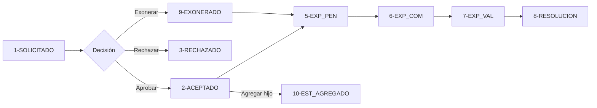

# Tabla BECA_SOLICITUD - Resumen Completo

## 📊 Definición de la Tabla

```sql
CREATE TABLE BECA_SOLICITUD (
    ID_BECA_SOLICITUD BIGINT NOT NULL,
    ID_BECA_PERIODO BIGINT NOT NULL,
    FAMCOD VARCHAR(8) NOT NULL,
    FECHA_REG TIMESTAMP DEFAULT CURRENT_DATE NOT NULL,
    ESTADO SMALLINT DEFAULT 1 NOT NULL,
    
    CONSTRAINT PK_BECA_SOLICITUD PRIMARY KEY (ID_BECA_SOLICITUD),
    CONSTRAINT BECA_SOLICITUD_PERIODO FOREIGN KEY (ID_BECA_PERIODO) 
        REFERENCES BECA_PERIODO(ID_BECA_PERIODO)
);

CREATE INDEX BECA_SOLICITUD_PERIODO ON BECA_SOLICITUD (ID_BECA_PERIODO);
```

---

## 🔍 Detalle de Campos

### 1. ID_BECA_SOLICITUD (BIGINT, PK)

**Descripción:** Identificador único de la solicitud de beca

**Valores:**
- Generado automáticamente por secuencia `GEN_BECA_SOLICITUD_ID`
- Ejemplo: `123`, `456`, `789`

**Cuándo se asigna:**
- Al crear una nueva solicitud en `procesoSolicitud`

**Código:**
```javascript
const ID_BECA_SOLICITUD = await expr.nextSequenceId('GEN_BECA_SOLICITUD_ID')
```

---

### 2. ID_BECA_PERIODO (BIGINT, FK, NOT NULL)

**Descripción:** Periodo de becas al que pertenece la solicitud

**Valores:**
- Foreign Key → `BECA_PERIODO.ID_BECA_PERIODO`
- Debe ser un periodo activo o vigente
- Ejemplo: `1`, `2`, `3`

**Cuándo se asigna:**
- Al crear la solicitud, se obtiene el periodo activo actual
- Se puede especificar manualmente o se toma el periodo vigente

**Código:**
```javascript
const dataPer = await Becasol.app.models.becaperiodo.getCurrentPeriodoAsync(knex)
_periodo = dataPer.ID_BECA_PERIODO
```

**Validaciones:**
- Debe existir un periodo activo
- Una familia solo puede tener una solicitud por periodo

---

### 3. FAMCOD (VARCHAR(8), FK, NOT NULL)

**Descripción:** Código de la familia que solicita la beca

**Valores:**
- Foreign Key → `FAMILIA.FAMCOD`
- Formato: Cadena de hasta 8 caracteres
- Ejemplo: `'FAM001'`, `'FAM123'`, `'0012345'`

**Cuándo se asigna:**
- Al crear la solicitud, se toma del token del usuario o parámetro
- Generalmente viene del usuario autenticado

**Código:**
```javascript
const _famcod = famcod || token.FAMCOD
```

**Validaciones:**
- La familia debe existir en la tabla `FAMILIA`
- No puede tener otra solicitud en el mismo periodo
- Debe cumplir requisitos de antigüedad, hijos, deudas (según colegio)

---

### 4. FECHA_REG (TIMESTAMP, NOT NULL, DEFAULT CURRENT_DATE)

**Descripción:** Fecha y hora de registro de la solicitud

**Valores:**
- Timestamp completo con fecha y hora
- Default: Fecha/hora actual del sistema
- Ejemplo: `2024-03-15 14:30:00`, `2024-06-20 09:15:30`

**Cuándo se asigna:**
- Automáticamente al crear la solicitud
- Siempre es `new Date()` en JavaScript

**Código:**
```javascript
FECHA_REG: new Date()
```

**Uso:**
- Ordenar solicitudes por fecha (más recientes primero)
- Filtrar solicitudes por rango de fechas
- Auditoría y trazabilidad

---

### 5. ESTADO (SMALLINT, NOT NULL, DEFAULT 1)

**Descripción:** Estado actual del proceso de la solicitud de beca

**Valores posibles:**

| Valor | Constante | Nombre | Descripción |
|-------|-----------|--------|-------------|
| **1** | `ESTADO_SOLICITADO` | Solicitado | Solicitud inicial creada por la familia |
| **2** | `ESTADO_ACEPTADO` | Aceptado | Aprobada por administrador, genera deuda automática |
| **3** | `ESTADO_RECHAZADO` | Rechazado | Solicitud rechazada, proceso terminado |
| **4** | `ESTADO_PAGO` | Con Pago | Tiene pagos registrados en el sistema |
| **5** | `ESTADO_EXP_PEN` | Expediente Pendiente | Esperando carga de documentos |
| **6** | `ESTADO_EXP_COM` | Expediente Completo | Todos los documentos subidos |
| **7** | `ESTADO_EXP_VAL` | Expediente Validado | Documentos validados por administrador |
| **8** | `ESTADO_RESOLUCION` | En Resolución | Proceso de resolución final |
| **9** | `ESTADO_EXONERADO` | Exonerado | Aprobado sin generar deuda |
| **10** | `ESTADO_ESTUDIANTE_AGREGADO` | Estudiante Agregado | Hijo agregado a solicitud existente |

**Cuándo cambia:**

#### Estado 1 → SOLICITADO
```javascript
// Al crear la solicitud
ESTADO: ESTADO_SOLICITADO  // = 1
```

#### Estado 2 → ACEPTADO
```javascript
// Al aprobar sin exonerar
procesoAprobarSolicitud(id, famcod, estudiantes, exonerar=0)
// Genera deuda automática por concepto BECA (3)
```

#### Estado 3 → RECHAZADO
```javascript
// Al rechazar la solicitud
procesoUpdateEstado(id, ESTADO_RECHAZADO)
```

#### Estado 5 → EXP_PEN
```javascript
// Al iniciar carga de documentos
// (Asignado manualmente o por proceso)
```

#### Estado 6 → EXP_COM
```javascript
// Automático cuando expediente está completo
updateEstadosSol(periodo)
// Verifica: checkExpedienteCompletoAsync()
```

#### Estado 7 → EXP_VAL
```javascript
// Automático cuando expediente es validado
updateEstadosSol(periodo)
// Verifica: checkExpedienteValidadoAsync()
```

#### Estado 9 → EXONERADO
```javascript
// Al aprobar con exoneración
procesoAprobarSolicitud(id, famcod, estudiantes, exonerar≠0)
// NO genera deuda
```

#### Estado 10 → ESTUDIANTE_AGREGADO
```javascript
// Al agregar hijo posterior
procesoAprobarSolicitud(id, famcod, estudiantes, exonerar, agregaEstudiante=true)
```

**Restricciones:**
- No se puede eliminar si ESTADO >= 4 (excepto si es 9)
- No se puede eliminar si ESTADO = 2 sin flag especial

---

## 🔄 Flujo de Estados Típico



---

## 📝 Operaciones CRUD

### CREATE (Insertar)
```javascript
// Método: procesoSolicitud
await knex('BECA_SOLICITUD').insert({
    ID_BECA_SOLICITUD: [secuencia],
    ID_BECA_PERIODO: [periodo activo],
    FAMCOD: [código familia],
    FECHA_REG: new Date(),
    ESTADO: 1  // SOLICITADO
})
```

### READ (Consultar)
```javascript
// Método: getSolicitudesAsync
await knex('BECA_SOLICITUD AS BS')
    .innerJoin('FAMILIA AS F', 'F.FAMCOD', 'BS.FAMCOD')
    .where('BS.ID_BECA_PERIODO', periodo)
    .select('BS.*', 'F.FAMDES')
```

### UPDATE (Actualizar)
```javascript
// Método: updateStateAsync
await knex('BECA_SOLICITUD')
    .where('ID_BECA_SOLICITUD', id)
    .update({ ESTADO: nuevoEstado })
```

### DELETE (Eliminar)
```javascript
// Método: procesoEliminarSolicitud
// Solo si no tiene pagos ni deudas
await knex('BECA_SOLICITUD')
    .where('ID_BECA_SOLICITUD', id)
    .del()
```

---

## 🔗 Relaciones con Otras Tablas

### Tabla Padre
- **BECA_PERIODO:** Define el periodo de becas
  - `ID_BECA_PERIODO` → `BECA_PERIODO.ID_BECA_PERIODO`

### Tablas Relacionadas (no FK directo)
- **FAMILIA:** Familia solicitante
  - `FAMCOD` → `FAMILIA.FAMCOD`

### Tablas Hijas
- **BECA_PARTICIPANTE:** Estudiantes incluidos en la solicitud
- **BECA_DOC_ASIGNA:** Documentos asignados a la solicitud
- **BECA_ESTADO_FECHA:** Historial de cambios de estado
- **BECA_EXPEDIENTE:** Expediente de documentos

---

## ⚠️ Validaciones y Restricciones

### Al Insertar (CREATE)
- ✅ Debe existir periodo activo
- ✅ Familia no debe tener solicitud previa en el periodo
- ✅ Familia debe cumplir requisitos (antigüedad, hijos, deudas)
- ✅ ID debe ser único (generado por secuencia)

### Al Actualizar (UPDATE)
- ✅ Solo se actualiza el campo ESTADO
- ✅ Cambios se registran en BECA_ESTADO_FECHA
- ✅ Algunos cambios son automáticos (estados 6 y 7)

### Al Eliminar (DELETE)
- ❌ No se puede si ESTADO >= 4 (excepto 9)
- ❌ No se puede si ESTADO = 2 sin flag
- ✅ Debe eliminar registros relacionados primero (cascada manual)

---

## 📊 Índices

```sql
CREATE INDEX BECA_SOLICITUD_PERIODO ON BECA_SOLICITUD (ID_BECA_PERIODO);
```

**Propósito:**
- Acelerar consultas por periodo
- Mejorar performance en filtros por `ID_BECA_PERIODO`

---

## 💡 Casos de Uso por Campo

### ID_BECA_SOLICITUD
- Identificar solicitud única
- Relacionar con participantes, documentos, estados

### ID_BECA_PERIODO
- Filtrar solicitudes por periodo académico
- Validar una solicitud por familia por periodo

### FAMCOD
- Identificar familia solicitante
- Validar requisitos de la familia
- Relacionar con alumnos y usuarios

### FECHA_REG
- Ordenar solicitudes cronológicamente
- Filtrar por rango de fechas
- Auditoría y reportes

### ESTADO
- Controlar flujo del proceso
- Determinar acciones permitidas
- Mostrar progreso a la familia
- Generar reportes por estado
