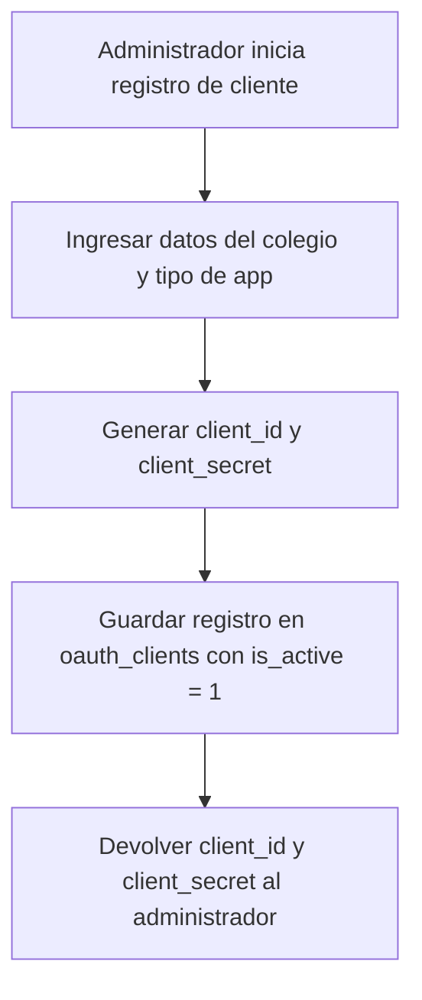
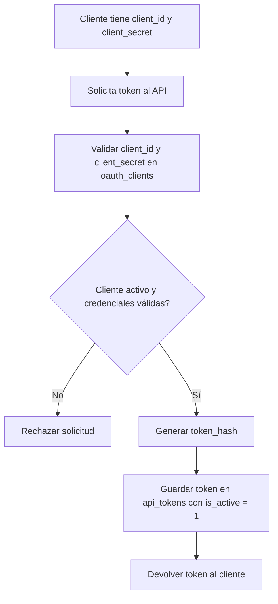
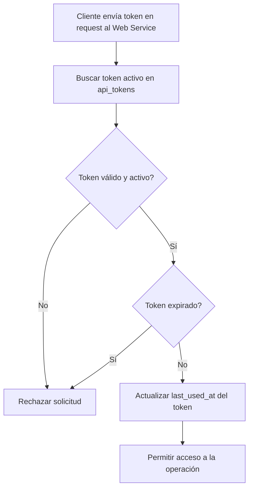
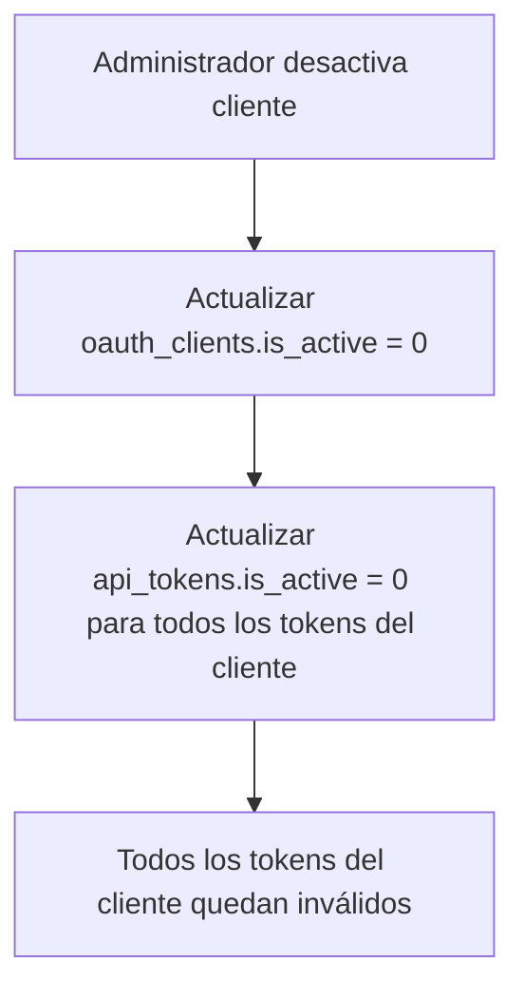
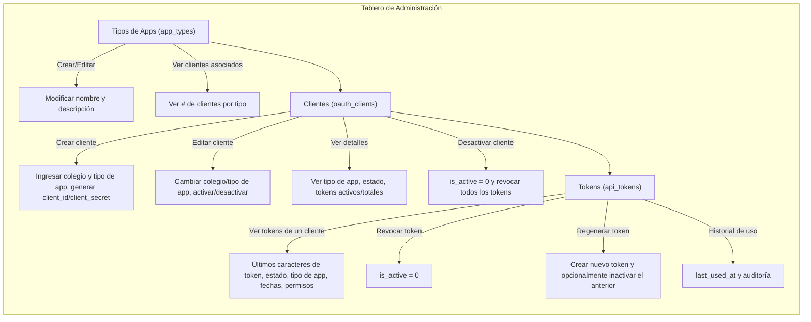

# Documentación de Web Services – sieWeb

## 1. Introducción

Esta documentación describe los servicios web disponibles para `sieWeb`, incluyendo autenticación, gestión de clientes OAuth, tokens API y sus permisos.  

El sistema está diseñado para que cada colegio pueda registrar su aplicación, generar clientes OAuth y tokens de acceso con permisos específicos.

---

## 2. Tablas

```sql
CREATE TABLE app_types (
  id INT AUTO_INCREMENT PRIMARY KEY,
  name VARCHAR(255) NOT NULL UNIQUE,    -- Ej: 'App Móvil', 'Portal Web', 'Sistema Administrativo'
  description TEXT DEFAULT NULL
);

CREATE TABLE oauth_clients (
  id BIGINT UNSIGNED AUTO_INCREMENT PRIMARY KEY,

  colcod VARCHAR(20) NOT NULL,           -- Código interno del colegio
  colname VARCHAR(255) NOT NULL,         -- Nombre del colegio
  type_id INT NOT NULL,                   -- FK a app_types

  client_id CHAR(36) NOT NULL UNIQUE,    -- UUID único generado
  client_secret CHAR(64) NOT NULL,       -- Guardado como hash
  is_active TINYINT(1) DEFAULT 1,        -- 1 = activo, 0 = inactivo

  created_at DATETIME NOT NULL,
  updated_at DATETIME NOT NULL,

  FOREIGN KEY (type_id) REFERENCES app_types(id),
  UNIQUE KEY uq_colcod_type (colcod, type_id),   -- Garantiza un cliente por colegio por tipo de app
  INDEX idx_colcod_type_active (colcod, type_id, is_active)  -- para búsquedas rápidas
);

CREATE TABLE api_tokens (
  id BIGINT UNSIGNED AUTO_INCREMENT PRIMARY KEY,

  client_id CHAR(36) NOT NULL,           -- FK a oauth_clients
  token_hash CHAR(64) NOT NULL,
  abilities JSON DEFAULT NULL,           -- Permisos opcionales

  last_used_at DATETIME NULL,
  expires_at DATETIME NULL,

  is_active TINYINT(1) DEFAULT 1,       -- 1 = activo, 0 = revocado

  created_at DATETIME NOT NULL,
  updated_at DATETIME NOT NULL,

  FOREIGN KEY (client_id) REFERENCES oauth_clients(client_id),
  UNIQUE KEY uq_token_hash (token_hash),
  INDEX idx_client_active (client_id, is_active)
);
```

## 3. Diagramas de flujo

### 1️⃣ Registro de cliente por el administrador

### 2️⃣ Cliente usa credenciales para obtener un token


### 3️⃣ Cliente usa el token para consumir el Web Service (alta frecuencia, optimizado)


### Desactivación de cliente y revocación de tokens (nuevo)


## 4. Funcionalidades del panel de administracion



## 5. Prompt para la ia

```
# Prompt para Figma AI – Tablero One-Page

Diseña un **dashboard profesional de administración de clientes y tokens OAuth**, **toda la información en una sola pantalla**.  
La interfaz debe ser **modular, limpia y escalable**, con **secciones visibles simultáneamente**, sin navegación lateral externa.  

**Colores:**  
- Verde = activo  
- Rojo = inactivo/revocado  
- Amarillo = pendiente  
- Tipografía clara y legible

---

## Layout general

- Pantalla dividida en **paneles tipo card o paneles horizontales/apilables**:
  - Tipos de Apps (`app_types`)
  - Clientes (`oauth_clients`)
  - Tokens (`api_tokens`)
  - Métricas / Reportes
- Filtros globales arriba de cada panel (por `colcod`, `colname`, `type_id`)
- Paginación y búsqueda dentro de cada tabla
- Botones de acción rápida: crear, editar, activar/desactivar cliente, revocar/regenerar token
- Cada fila de cliente puede expandirse para ver **tokens asociados**

---

## 1️⃣ Panel: Tipos de Apps (`app_types`)

- Tabla con columnas: `ID`, `Nombre`, `Descripción`, `# Clientes asociados`
- Acciones: **Crear / Editar**
- Tarjetas o tabla compacta, **sin opción de desactivar**

---

## 2️⃣ Panel: Clientes (`oauth_clients`)

- Tabla con columnas:  
  - `ID`  
  - `Colegio (colcod / colname)`  
  - `Tipo de App`  
  - `client_id`  
  - `Estado`  
  - `Fecha creación`  
  - `Fecha actualización`  
  - `# Tokens activos`  
  - `# Tokens totales`
- Acciones: **Crear cliente**, **Editar cliente**, **Activar/Desactivar cliente**
- Expansión de fila para mostrar **tokens asociados** con:  
  - Últimos 6-8 caracteres  
  - Tipo de app  
  - Estado  
  - Fechas  
  - Permisos
- Al desactivar cliente: todos sus tokens se inactivan automáticamente

---

## 3️⃣ Panel: Tokens (`api_tokens`)

- Tabla con columnas:  
  - `ID`  
  - `Cliente`  
  - Últimos 6-8 caracteres de token  
  - Tipo de App  
  - Estado  
  - Creación  
  - Expiración  
  - Último uso  
  - Permisos
- Acciones: **Revocar token**, **Regenerar token** (opcional inactivar anterior)
- Modal o tooltip para ver historial completo de uso

---

## 4️⃣ Panel: Métricas y Reportes

- Tarjetas con:  
  - Clientes activos/inactivos  
  - Tokens activos/inactivos por cliente o tipo de app  
  - Tokens expirados o sin uso en X días  
  - Clientes con múltiples tokens activos  
  - Tiempos promedio de uso de tokens
- Gráficos tipo **barra, línea o donut** para cada métrica

---

## Diseño y usabilidad

- Tablas con **paginación, búsqueda y filtros rápidos**
- Botones de acción **visibles y consistentes**, con iconografía clara
- Paneles organizados **verticalmente o en rejilla responsive**, todo en la misma pantalla
- Auditoría: mostrar **quién creó/modificó/desactivó** cliente o token y **timestamp**
- Preferir **cards y tablas compactas**, con expansión de filas para detalles
- Todo optimizado para **administración de alta frecuencia** y múltiples clientes/tokens

```
